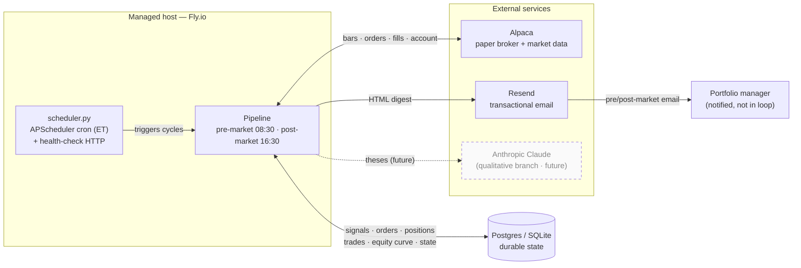
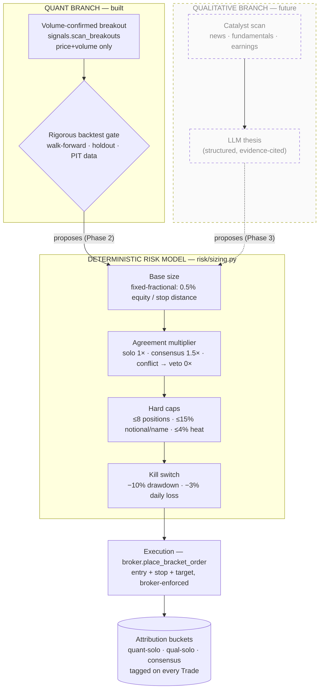

# Architecture block diagram

A visual companion to [`CLAUDE.md`](../CLAUDE.md) and the [ADRs](adr/). It shows
how the conceptual hedge-fund org chart maps onto **one orchestrated,
mostly-deterministic pipeline** ([ADR-0002](adr/0002-hybrid-pipeline-architecture.md)):
**LLMs reason, deterministic code decides and executes.**

> **Legend.** Solid boxes = built (Phase 1 walking skeleton, [ADR-0007](adr/0007-build-sequencing-and-roadmap.md)).
> Dashed boxes = designed but **not yet built** (quant backtest gate, qualitative
> branch, agreement multiplier). Phase-1 trades **quant-solo only**; all paper
> results are explicitly **not** track record until the backtest gate is passed.

---

## 1. System context

The runtime is a twice-daily batch on a managed host ([ADR-0006](adr/0006-stack-runtime-and-reporting.md)).
No always-on intraday loop — broker-side bracket orders carry intraday risk
([ADR-0005](adr/0005-trading-scope-universe-strategy-broker-data.md)).

---

## 2. Twice-daily pipeline (org chart → stages)

Each "role" in the fund is a **pipeline stage**, not an autonomous agent. The
pre-market cycle plans and places orders; the post-market cycle reconciles and
reports.

---

## 3. Two-branch alpha model + deterministic risk gate

Both branches **originate** trades; **only deterministic code executes**. The
risk model and kill switch are the **final authority** and bind both branches
unconditionally ([ADR-0003](adr/0003-two-branch-alpha-and-validation-asymmetry.md),
[ADR-0004](adr/0004-risk-management-framework.md)).

---

## 4. Module map

| Layer | Module | Responsibility |
| ----- | ------ | -------------- |
| Orchestration | `scheduler.py` | APScheduler cron (08:30 / 16:30 ET, mon–fri) + health server |
| Pipeline | `pipeline/pre_market.py` | Scan → size → place bracket orders → email |
| Pipeline | `pipeline/post_market.py` | Reconcile fills/positions → equity curve → kill switch → email |
| Pipeline | `pipeline/signals.py` | Volume-confirmed breakout scanner (quant branch) |
| Risk | `risk/sizing.py` | Fixed-fractional sizing, caps, agreement multiplier, kill switch |
| Broker | `broker/interface.py` | Swappable `BrokerInterface` protocol (the multi-asset seam) |
| Broker | `broker/alpaca.py` | Alpaca paper adapter |
| Data | `data/market.py` | Daily bars from Alpaca |
| Data | `data/universe.py` | S&P 100 universe (static snapshot; PIT membership is future) |
| Persistence | `db/models.py` | SQLAlchemy: RunLog, Signal, Order, Position, Trade, EquityCurve, SystemState |
| Reporting | `reporting/email_report.py` | Pre/post-market HTML digests via Resend |
| Config | `config.py` | Settings, risk limits, logging |

---

_Keep this diagram in sync with the code: per [`CLAUDE.md`](../CLAUDE.md),
update it whenever an architectural change is made._
