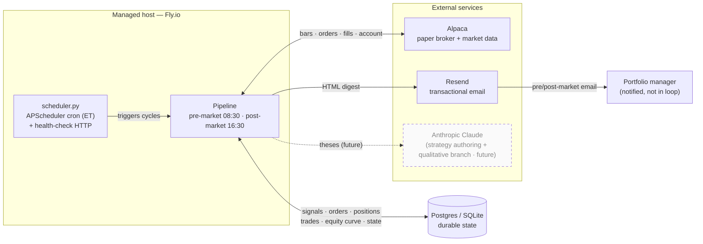
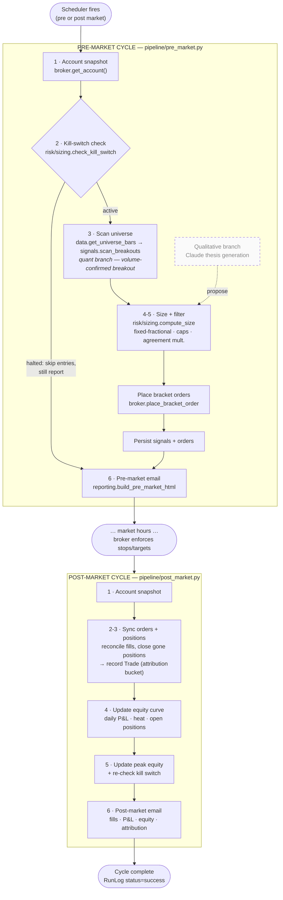
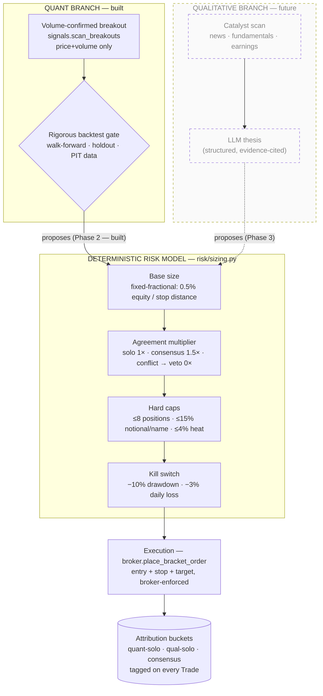

# Architecture block diagram

A visual companion to [`CLAUDE.md`](../CLAUDE.md) and the [ADRs](adr/). It shows
how the conceptual hedge-fund org chart maps onto **one orchestrated,
mostly-deterministic pipeline** ([ADR-0002](adr/0002-hybrid-pipeline-architecture.md)):
**LLMs reason, deterministic code decides and executes.**

> **Legend.** Solid boxes = built (Phase 1 walking skeleton + Phase 2 quant edge gate, [ADR-0007](adr/0007-build-sequencing-and-roadmap.md)).
> Dashed boxes = designed but **not yet built** (qualitative branch, agreement multiplier, quant-researcher authoring loop).
> Phase-1/2 trades **quant-solo only**; the official paper track record opens only after
> the strategy passes the rigorous backtest gate (run `scripts/evaluate_holdout.py`).

---

## 1. System context

The runtime is a twice-daily batch on a managed host ([ADR-0006](adr/0006-stack-runtime-and-reporting.md)).
No always-on intraday loop — broker-side bracket orders carry intraday risk
([ADR-0005](adr/0005-trading-scope-universe-strategy-broker-data.md)).

---

## 2. Twice-daily pipeline (org chart → stages)

Each "role" in the fund is a **pipeline stage**, not an autonomous agent. The
pre-market cycle plans and places orders; the post-market cycle reconciles and
reports.

---

## 3. Two-branch alpha model + deterministic risk gate

Both branches **originate** trades; **only deterministic code executes**. The
risk model and kill switch are the **final authority** and bind both branches
unconditionally ([ADR-0003](adr/0003-two-branch-alpha-and-validation-asymmetry.md),
[ADR-0004](adr/0004-risk-management-framework.md)).

---

## 3b. Quant-researcher authoring loop (offline · human-gated · designed)

[ADR-0009](adr/0009-llm-authored-strategy-contract.md) lets an LLM **author**
strategies, not just trade them. The loop is **offline and human-triggered** — it
never runs in the trade pipeline, and it **stops at walk-forward**; touching the
sealed holdout stays the separate, human-gated `evaluate_holdout.py`
([ADR-0008](adr/0008-validation-data-discipline.md),
[ADR-0010](adr/0010-effective-trial-accounting.md)).

```mermaid
flowchart LR
    pm["Portfolio manager<br/>natural-language theory"] --> author
    subgraph research["QUANT RESEARCHER — authoring loop (designed, not built)"]
        author["LLM author · quant_research/author.py<br/>Claude · tool-use → StrategySpec"]
        spec["DSL spec<br/>entry/exit over primitive registry<br/>+ 4-part economic rationale"]
        compile["compile_spec → StrategyBase<br/>quant_research/compiler.py"]
        nbhd["neighbor family<br/>deterministic ±1 step · K-cap"]
        author --> spec --> compile --> nbhd
    end
    nbhd --> wf["WalkForwardCV (generalized)<br/>(config_identity, StrategyBase)<br/>DSR · PBO · effective-N"]
    wf --> report["AuthoringReport<br/>FROZEN — eligible for holdout | FAIL — refine in-sample"]
    report -->|persist trial + returns| db[("trial_log<br/>data-keyed search-N · returns_json")]
    report -.->|human spends holdout_n, separately| holdout["evaluate_holdout.py<br/>(unchanged human gate)"]

    classDef future stroke-dasharray:5 5,fill:#fafafa,color:#888;
    class research,author,spec,compile,nbhd future;
```

> The LLM emits a **spec**, never code; a deterministic compiler/executor runs it
> ([ADR-0002](adr/0002-hybrid-pipeline-architecture.md) boundary holds). Primitives
> are vetted point-in-time-safe Python fns in a registry the LLM only *composes*.
> Every strategy ever tested shares one **data-keyed** search-N counter; one
> authoring run — canonical spec, ±1-step neighbours, and all walk-forward folds
> — charges it a flat **1** (one bet, not N); the participation-ratio eff-N is a
> reported guardrail ([ADR-0010](adr/0010-effective-trial-accounting.md)).

---

## 4. Module map

| Layer | Module | Responsibility |
| ----- | ------ | -------------- |
| Orchestration | `scheduler.py` | APScheduler cron (08:30 / 16:30 ET, mon–fri) + health server |
| Pipeline | `pipeline/pre_market.py` | Scan → size → place bracket orders → email |
| Pipeline | `pipeline/post_market.py` | Reconcile fills/positions → equity curve → kill switch → email |
| Pipeline | `pipeline/signals.py` | Volume-confirmed breakout scanner (quant branch) |
| Risk | `risk/sizing.py` | Fixed-fractional sizing, caps, agreement multiplier, kill switch |
| Broker | `broker/interface.py` | Swappable `BrokerInterface` protocol (the multi-asset seam) |
| Broker | `broker/alpaca.py` | Alpaca paper adapter |
| Data | `data/market.py` | Daily bars from Alpaca |
| Data | `data/universe.py` | S&P 100 universe (static snapshot; PIT membership is future) |
| Persistence | `db/models.py` | SQLAlchemy: RunLog, Signal, Order, Position, Trade, EquityCurve, SystemState + BacktestTrial, PartitionCounter, HoldoutEval |
| Reporting | `reporting/email_report.py` | Pre/post-market HTML digests via Resend |
| Config | `config.py` | Settings, risk limits, logging |
| Backtest | `backtest/engine.py` | Event-driven daily-bar backtester (point-in-time, honest stops, cost model) |
| Backtest | `backtest/strategy.py` | StrategyBase + BreakoutStrategy (vectorised signal precomputation) |
| Backtest | `backtest/metrics.py` | Annualised Sharpe, PSR, DSR (Bailey & de Prado), PBO, gate thresholds |
| Backtest | `backtest/validation.py` | WalkForwardCV (expanding window + embargo), HoldoutEvaluator (one-shot) |
| Backtest | `backtest/data.py` | yfinance historical bar loader with disk cache |
| Backtest | `backtest/trial_log.py` | Monotonic partition trial counters + trial/holdout logging |
| Quant research | `quant_research/dsl.py` | StrategySpec (pydantic) + point-in-time primitive registry — _designed_ |
| Quant research | `quant_research/compiler.py` | `compile_spec → StrategyBase` — _designed_ |
| Quant research | `quant_research/neighborhood.py` | Deterministic ±1-step neighbor family (K-cap) for DSR/PBO — _designed_ |
| Quant research | `quant_research/author.py` | LLM author: Anthropic tool-use → validated spec — _designed_ |
| Scripts | `scripts/run_backtest.py` | Walk-forward search over param grid; logs every trial to DB |
| Scripts | `scripts/evaluate_holdout.py` | Human-gated one-shot holdout evaluation; opens official track record |
| Scripts | `scripts/author_strategy.py` | Human-triggered: PM theory → DSL spec → walk-forward → AuthoringReport — _designed_ |

---

_Keep this diagram in sync with the code: per [`CLAUDE.md`](../CLAUDE.md),
update it whenever an architectural change is made._
